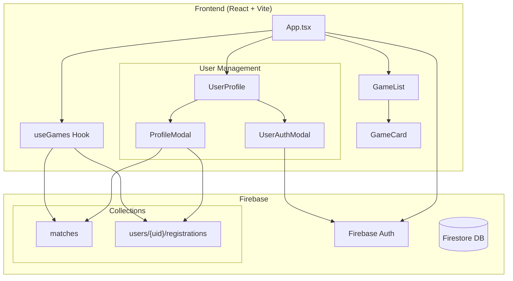
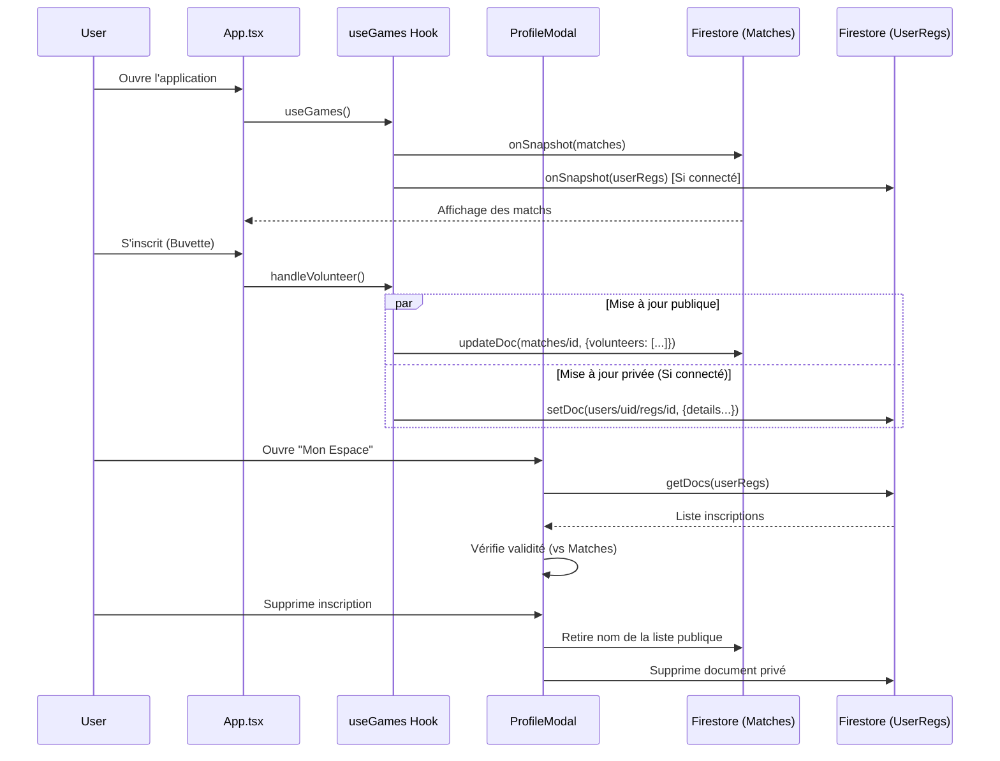

# SCBA Bénévoles 🏀

[](https://scba.desimone.fr)
[](https://coolify.io)

Application de gestion du bénévolat pour le **Stade Clermontois Basket Auvergne**.


## 🏗️ Architecture



### Flux de données



## ✨ Fonctionnalités

### 👥 Pour les parents & Bénévoles

- **Inscription facile** :
  - **Invité** : Inscription immédiate sans compte (stockage local).
  - **Connecté** : Création de compte (Google ou Email) pour gérer ses inscriptions partout.
- **👤 Mon Espace Bénévoles** :
  - Vue centralisée de toutes vos inscriptions.
  - Gestion et annulation sécurisée de vos missions.
  - Détection automatique des inscriptions obsolètes ou orphelines.
- **Interface moderne** : Design épuré avec dégradés, cartes animées
- **📅 Ajouter au calendrier** : exportez vers Google Agenda, Apple Calendar ou Outlook
- **🚗 Covoiturage** : proposez des places (conducteur) ou cherchez une place (passager)
- **🔄 Mise à jour automatique** : synchronisation temps réel via Firebase
- **📅 Mon Planning** : Vue personnalisée filtrant uniquement vos matchs
- **💊 Badge Covoiturage** : Notification immédiate des places dispo

### 🔧 Pour les administrateurs

- **🔐 Authentification Firebase** : Connexion sécurisée
- **🏠 Matchs Domicile / 🚗 Extérieur** : différenciation des types de matchs
- **📥 Import en masse** : Copier-coller depuis le calendrier FFBB
- **Gestion des matchs** : ajouter, modifier, supprimer

### 🎨 Interface moderne

- Design responsive (mobile & desktop)
- Skeleton Loader pendant le chargement
- Animation de célébration quand un match est complet
- Notifications toast avec auto-dismiss

## 📋 Prérequis

- **Node.js** : v22.12.0 ou supérieur (nécessaire pour Vite 7)

## 🚀 Installation

```bash
# Cloner le dépôt
git clone https://github.com/nickdesi/SCBA-Benevolat.git
cd SCBA-Benevolat

# Installer les dépendances
npm install

# Lancer en développement
npm run dev
```

## ⚙️ Configuration

### Firebase Authentication

Le projet supporte deux niveaux d'accès :

1. **Utilisateurs (Bénévoles)** : Inscription via Google ou Email/Mot de passe pour gérer leur profil.
2. **Administrateur** : Compte unique (`benevole@scba.fr`) avec droits d'édition globaux.

### Variables d'environnement (optionnel)

```env
VITE_FIREBASE_API_KEY=your_api_key
VITE_FIREBASE_AUTH_DOMAIN=your_project.firebaseapp.com
VITE_FIREBASE_PROJECT_ID=your_project_id
```

## 📁 Structure du projet

```
├── App.tsx                 # Composant principal (UI + state + lazy loading)
├── firebase.ts             # Config Firebase (Firestore + Auth)
│
├── components/
│   ├── UserProfile.tsx     # [NEW] Menu utilisateur et avatar
│   ├── ProfileModal.tsx    # [NEW] Modal "Mon Espace Bénévole"
│   ├── UserAuthModal.tsx   # [NEW] Modal Connexion/Inscription
│   ├── GameList.tsx        # Liste groupée des matchs
│   ├── GameCard.tsx        # Carte de match (memoized + lazy GameForm)
│   ├── GameForm.tsx        # Formulaire ajout/édition (lazy-loaded)
│   ├── VolunteerSlot.tsx   # Inscriptions bénévoles (logique hybride Guest/Auth)
│   ├── CarpoolingSection.tsx # Section covoiturage
│   ├── PhoneDisplay.tsx    # Affichage téléphone avec masquage
│   ├── AdminAuthModal.tsx  # Login Admin (lazy-loaded)
│   ├── ImportCSVModal.tsx  # Import CSV (lazy-loaded)
│   ├── Header.tsx          # En-tête avec filtre équipe
│   ├── BottomNav.tsx       # Navigation mobile
│   ├── MatchTicker.tsx     # Bandeau défilant
│   └── ...
│
├── utils/
│   ├── useGames.ts         # Hook Firebase (CRUD + Sync Profil Utilisateur)
│   ├── authStore.ts        # Auth Firebase (Google, Email)
│   ├── dateUtils.ts        # Parsing dates centralisé
│   ├── calendar.ts         # Export calendrier (ICS, Google, Outlook)
│   ├── storage.ts          # Utilitaires localStorage
│
├── types.ts                # Types TypeScript
├── constants.ts            # Constantes (rôles, mois)
└── styles.css              # Design system global
```

## ⚡ Optimisations

### Code-Splitting (React.lazy)

Les modals et formulaires sont chargés à la demande :

- `AdminAuthModal` (~5 KB)
- `ImportCSVModal` (~14 KB)
- `GameForm` (~10 KB)

### Bundle Splitting (Vite 7)

- Séparation automatique des dépendances (`vendor-react`, `vendor-firebase`) via `manualChunks`.
- Réduction significative du bundle principal (Main Entry < 300kB).

### Firestore Query

Seuls les matchs futurs sont récupérés (server-side filter) :

```typescript
query(collection(db, "matches"), where("dateISO", ">=", todayISO))
```

## 🔒 Sécurité & Confidentialité

- **Modèle Hybride d'Identité** :
  - **Invités** : L'identité est stockée dans le `localStorage` du navigateur.
  - **Connectés** : L'identité est vérifiée via Firebase Auth et stockée dans Firestore (`users/{uid}/registrations`).
- **Isolation des données** : Un utilisateur connecté ne peut gérer que ses propres inscriptions.
- **Firebase Security** : Authentification et règles de sécurité Firestore.
- **Protection des données** : Validation en temps réel pour empêcher la suppression d'inscriptions d'autres utilisateurs.

## 📱 Responsive

L'application est optimisée pour :

- 📱 Mobile (boutons pleine largeur, navigation tactile)
- 💻 Desktop (grille 2 colonnes, hover effects)

## 🎉 Célébration automatique

Quand tous les postes d'un match sont pourvus :

- Carte passe en vert avec animation
- Badge "COMPLET" affiché
- Message de remerciement

---

Fait avec ❤️ pour le Stade Clermontois Basket Auvergne
