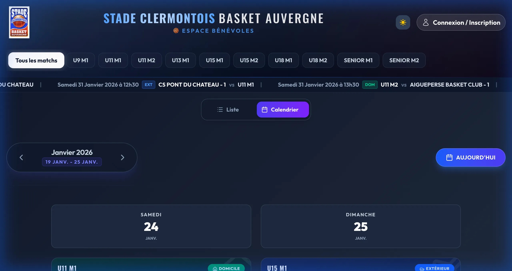
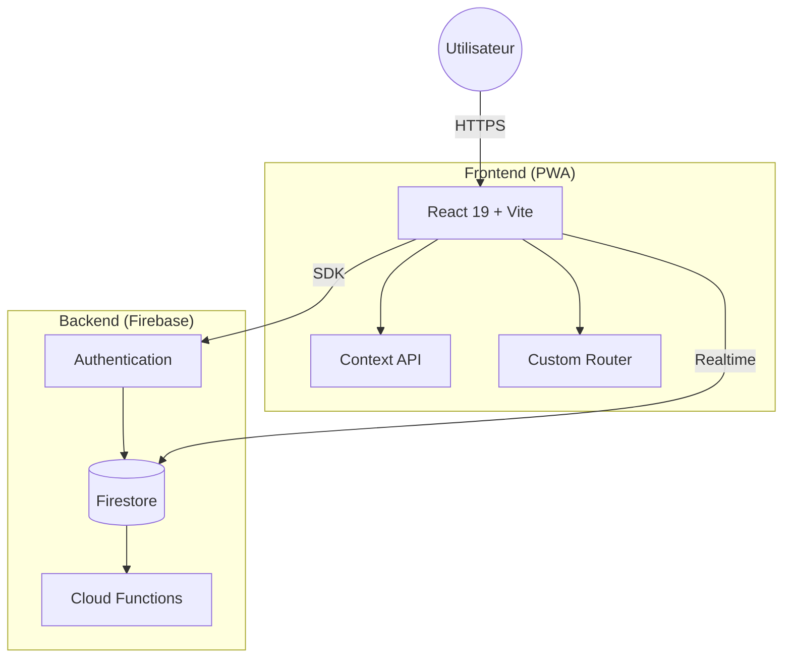

# SCBA Bénévoles 🏀

[](https://coolify.io)
[](https://github.com/nickdesi/SCBA-Benevolat/releases)
[](https://web.dev/progressive-web-apps/)
[](https://firebase.google.com/)

> **L'application officielle de gestion du bénévolat pour le Stade Clermontois Basket Auvergne.**
> Une expérience moderne, fluide et sociale pour simplifier la vie du club.



## ✨ Expérience "Pro Max"

Cette application a été conçue avec une philosophie **"Mobile First"** et un souci du détail extrême.

### 🎨 Interface Premium

- **Vibrant Glassmorphism** : Utilisation intensive de flous d'arrière-plan, de dégradés profonds (Indigo/Slate) et de transparences.
- **Micro-interactions** : Chaque clic, survol ou chargement est accompagné d'une animation fluide (`framer-motion`).
- **Dark Mode Natif** : L'interface s'adapte automatiquement à votre système avec une palette de couleurs soignée.

### 🚀 Fonctionnalités Clés

| Fonctionnalité | Description |
| :--- | :--- |
| **📅 Gestion Matchs** | Vue calendrier ou liste, filtres par équipe, urgence < 48h. |
| **🙋‍♂️ Bénévolat** | Inscription en 1 clic (Invité ou Connecté), gestion des rôles (Table, Bar, etc.). |
| **🚗 Covoiturage** | Système intelligent "Conducteur/Passager" avec calcul automatique des places restantes. |
| **📢 Broadcast** | Système d'annonces admin pour diffuser des messages urgents à tous les utilisateurs. |
| **📊 Dashboard** | Espace personnel pour suivre ses missions, son historique et ses stats. |
| **📚 Documentation** | Guides complets disponibles : [👤 Guide Bénévole](docs/GUIDE_BENEVOLE.md) et [🛡️ Guide Admin](docs/GUIDE_ADMIN.md). |

## 🏗️ Architecture Technique

Stack moderne orientée performance et maintenabilité.



### Choix Techniques

- **React 19** : Utilisation des dernières API (Concurrent features).
- **Tailwind v4** : Styling performant via le nouveau moteur JIT.
- **Firestore** : Base de données temps réel avec **Transactions Atomiques** pour garantir la cohérence des inscriptions.
- **PWA** : Support hors-ligne, installable sur iOS/Android.
- **API FFBB** : Synchronisation des matchs via [FFBBApiClientV2](https://github.com/Rinzler78/FFBBApiClientV2_Python).

## 📱 Guide d'Installation

### Prérequis

- Node.js v24+
- Clé API Firebase configurée

### Démarrage Rapide

```bash
# 1. Cloner le projet
git clone https://github.com/nickdesi/SCBA-Benevolat.git

# 2. Installer les dépendances
npm install

# 3. Lancer le serveur de développement
npm run dev
```

## 🔐 Sécurité

L'application utilise un modèle de sécurité hybride robuste :

1. **Règles Firestore** : Lecture publique (matchs), Écriture restreinte (Admin/Owner).
2. **Transactions** : Les inscriptions utilisent des transactions pour éviter les "Race Conditions".
3. **Sanitization** : Toutes les entrées utilisateur sont typées et validées.

---

**Version 2.0.1** — *Fait avec ❤️ à Clermont-Ferrand.*
