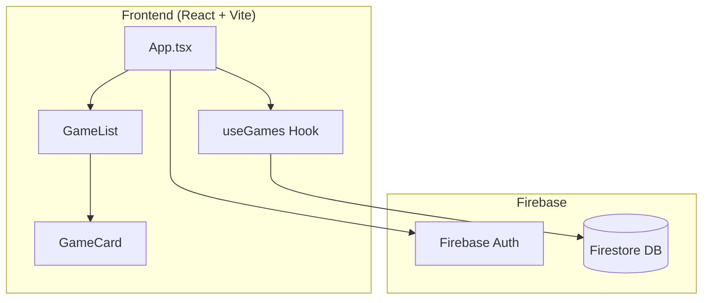
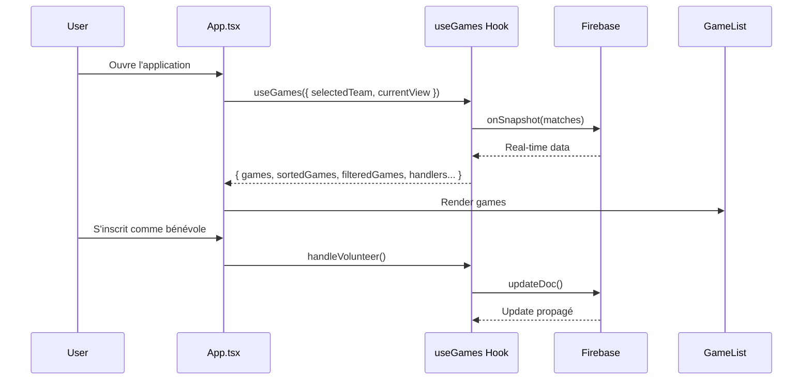

# SCBA Bénévoles 🏀

[](https://scba.desimone.fr)
[](https://coolify.io)

Application de gestion du bénévolat pour le **Stade Clermontois Basket Auvergne**.


## 🏗️ Architecture



### Flux de données



## ✨ Fonctionnalités

### 👥 Pour les parents

- **Inscription facile** : entrez votre nom et inscrivez-vous à un poste
- **Interface moderne** : Design épuré avec dégradés, cartes animées
- **📅 Ajouter au calendrier** : exportez vers Google Agenda, Apple Calendar ou Outlook
- **🚗 Covoiturage** : proposez des places (conducteur) ou cherchez une place (passager)
- **🔄 Mise à jour automatique** : synchronisation temps réel via Firebase
- **📅 Mon Planning** : Vue personnalisée filtrant uniquement vos matchs
- **💊 Badge Covoiturage** : Notification immédiate des places dispo

### 🔧 Pour les administrateurs

- **🔐 Authentification Firebase** : Connexion sécurisée par email/mot de passe
- **🏠 Matchs Domicile / 🚗 Extérieur** : différenciation des types de matchs
- **📥 Import en masse** : Copier-coller depuis le calendrier FFBB
- **Gestion des matchs** : ajouter, modifier, supprimer

### 🎨 Interface moderne

- Design responsive (mobile & desktop)
- Skeleton Loader pendant le chargement
- Animation de célébration quand un match est complet
- Notifications toast avec auto-dismiss

## 🚀 Installation

```bash
# Cloner le dépôt
git clone https://github.com/nickdesi/SCBA-Benevolat.git
cd SCBA-Benevolat

# Installer les dépendances
npm install

# Lancer en développement
npm run dev
```

## ⚙️ Configuration

### Firebase Authentication

L'authentification admin utilise **Firebase Auth (Email/Mot de passe)**.

1. Allez dans [Firebase Console](https://console.firebase.google.com/)
2. Sélectionnez votre projet → **Authentication** → **Users**
3. Cliquez **"Add user"** et créez un compte admin

### Variables d'environnement (optionnel)

```env
VITE_FIREBASE_API_KEY=your_api_key
VITE_FIREBASE_AUTH_DOMAIN=your_project.firebaseapp.com
VITE_FIREBASE_PROJECT_ID=your_project_id
```

## 📁 Structure du projet

```
├── App.tsx                 # Composant principal (UI + state + lazy loading)
├── firebase.ts             # Config Firebase (Firestore + Auth)
│
├── components/
│   ├── GameList.tsx        # Liste groupée des matchs
│   ├── GameCard.tsx        # Carte de match (memoized + lazy GameForm)
│   ├── GameForm.tsx        # Formulaire ajout/édition (lazy-loaded)
│   ├── VolunteerSlot.tsx   # Inscriptions bénévoles
│   ├── CarpoolingSection.tsx # Section covoiturage
│   ├── PhoneDisplay.tsx    # [NEW] Affichage téléphone avec masquage
│   ├── AdminAuthModal.tsx  # Login Firebase (lazy-loaded)
│   ├── ImportCSVModal.tsx  # Import CSV (lazy-loaded)
│   ├── Header.tsx          # En-tête avec filtre équipe
│   ├── BottomNav.tsx       # Navigation mobile
│   ├── MatchTicker.tsx     # Bandeau défilant
│   └── ...
│
├── utils/
│   ├── useGames.ts         # Hook Firebase (CRUD + query optimisée)
│   ├── authStore.ts        # Auth Firebase (signIn/signOut)
│   ├── dateUtils.ts        # Parsing dates centralisé
│   ├── calendar.ts         # Export calendrier (ICS, Google, Outlook)
│   └── storage.ts          # Utilitaires localStorage
│
├── types.ts                # Types TypeScript
├── constants.ts            # Constantes (rôles, mois)
└── styles.css              # Design system global
```

## ⚡ Optimisations

### Code-Splitting (React.lazy)

Les modals et formulaires sont chargés à la demande :

- `AdminAuthModal` (~5 KB)
- `ImportCSVModal` (~14 KB)
- `GameForm` (~10 KB)

### Firestore Query

Seuls les matchs futurs sont récupérés (server-side filter) :

```typescript
query(collection(db, "matches"), where("dateISO", ">=", todayISO))
```

## 🔒 Sécurité

- **Firebase Auth** : Authentification sécurisée par email/mot de passe
- **Firebase Firestore** : Synchronisation temps réel des données
- **TypeScript Strict** : Mode strict activé pour plus de sécurité
- **Données locales** : L'identité "C'est vous !" reste locale au navigateur

## 📱 Responsive

L'application est optimisée pour :

- 📱 Mobile (boutons pleine largeur, navigation tactile)
- 💻 Desktop (grille 2 colonnes, hover effects)

## 🎉 Célébration automatique

Quand tous les postes d'un match sont pourvus :

- Carte passe en vert avec animation
- Badge "COMPLET" affiché
- Message de remerciement

---

Fait avec ❤️ pour le Stade Clermontois Basket Auvergne
