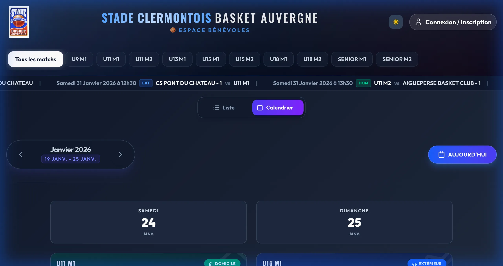
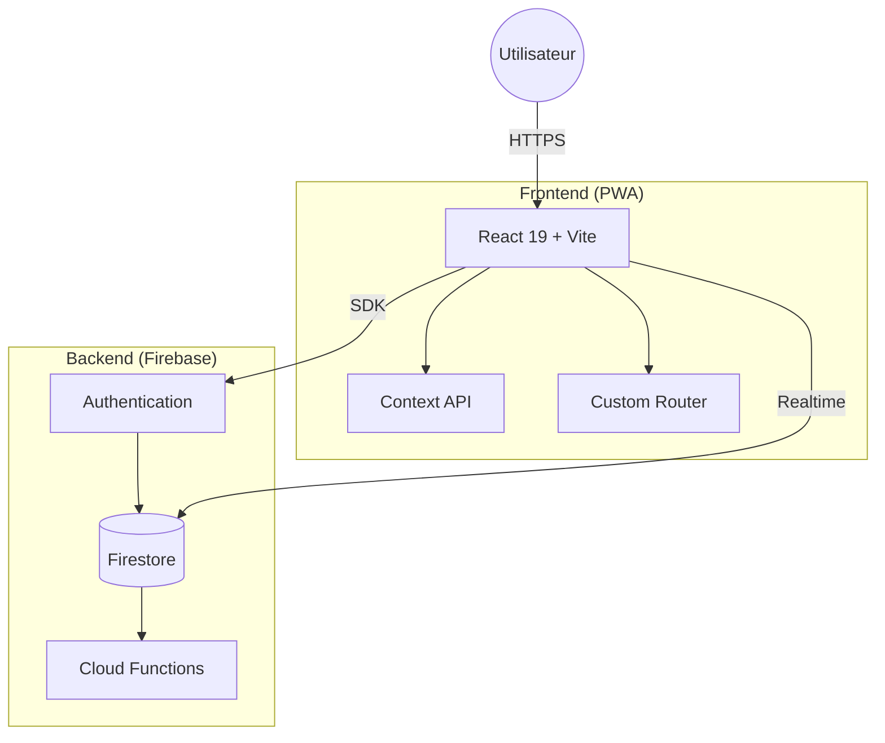

<div align="center">

# 🏀 SCBA Bénévoles

**L'application officielle de gestion du bénévolat du Stade Clermontois Basket Auvergne — une expérience moderne, fluide et sociale pour simplifier la vie du club.**

[](https://github.com/nickdesi/SCBA-Benevolat/actions/workflows/ci.yml)
[](https://github.com/nickdesi/SCBA-Benevolat/releases)
[](https://web.dev/progressive-web-apps/)
[](https://firebase.google.com/)
[](https://coolify.io)
[](#)
[](https://github.com/nickdesi/SCBA-Benevolat/stargazers)
[](https://github.com/nickdesi/SCBA-Benevolat/commits/main)
[](https://github.com/nickdesi/SCBA-Benevolat/issues)
[](https://github.com/nickdesi/SCBA-Benevolat/pulls)
[](SECURITY.md)



</div>

---

## 📋 Sommaire

- [🎯 À propos](#-à-propos)
- [✨ Fonctionnalités](#-fonctionnalités)
- [🚀 Démarrage rapide](#-démarrage-rapide)
- [🧱 Stack technique](#-stack-technique)
- [⚙️ Installation & configuration](#️-installation--configuration)
- [🏗️ Architecture technique](#️-architecture-technique)
- [🔐 Sécurité](#-sécurité)
- [🧪 Tests & qualité](#-tests--qualité)
- [📚 Documentation](#-documentation)
- [📋 Recommandations GitHub](#-recommandations-github)

## 🎯 À propos

Conçue avec une philosophie **Mobile First** et un souci du détail extrême, l'application offre :

- **🎨 Interface premium** — Glassmorphism, dégradés profonds (Indigo/Slate) et transparences soignées.
- **✨ Micro-interactions** — Chaque clic, survol ou chargement est animé avec `framer-motion`.
- **🌙 Dark Mode natif** — L'interface s'adapte automatiquement au thème de votre système.

## ✨ Fonctionnalités

| Fonctionnalité | Description |
| :--- | :--- |
| 📅 **Gestion des matchs** | Vue calendrier ou liste, filtres par équipe, mise en avant des urgences < 48h. |
| 🙋 **Bénévolat** | Inscription en 1 clic (invité ou connecté), gestion des rôles (Table, Bar, etc.). |
| 🚗 **Covoiturage** | Système intelligent « Conducteur / Passager » avec calcul automatique des places restantes. |
| 📢 **Broadcast** | Diffusion d'annonces admin pour les messages urgents à tous les utilisateurs. |
| 📊 **Dashboard** | Espace personnel : suivi des missions, historique et statistiques. |

## 🚀 Démarrage rapide

> Prérequis : **Node.js v24+** et un projet **Firebase** (Authentication + Firestore).

```bash
# 1. Cloner le projet
git clone https://github.com/nickdesi/SCBA-Benevolat.git
cd SCBA-Benevolat

# 2. Installer les dépendances
npm install

# 3. Lancer le serveur de développement
npm run dev
```

L'application est alors disponible sur `http://localhost:5173`. 🎉

## 🧱 Stack technique

- **React 19** — Dernières API (fonctionnalités concurrentes).
- **Vite** — Build ultra-rapide et HMR instantané.
- **Tailwind v4** — Styling performant via le nouveau moteur JIT.
- **Firestore** — Base de données temps réel avec **transactions atomiques** pour la cohérence des inscriptions.
- **PWA** — Support hors-ligne, installable sur iOS et Android.
- **API FFBB** — Synchronisation des matchs via [FFBB MCP Server](https://github.com/nickdesi/FFBB-MCP-Server).

## ⚙️ Installation & configuration

### Installation

```bash
npm install
```

### Configuration

Copiez le fichier d'exemple puis renseignez vos identifiants Firebase :

```bash
cp .env.example .env.local
```

| Variable | Description |
| :--- | :--- |
| `VITE_FIREBASE_API_KEY` | Clé API du projet Firebase. |
| `VITE_FIREBASE_AUTH_DOMAIN` | Domaine d'authentification. |
| `VITE_FIREBASE_PROJECT_ID` | Identifiant du projet. |
| `VITE_FIREBASE_STORAGE_BUCKET` | Bucket de stockage. |
| `VITE_FIREBASE_MESSAGING_SENDER_ID` | Identifiant d'expéditeur (messaging). |
| `VITE_FIREBASE_APP_ID` | Identifiant de l'application. |

### Scripts disponibles

| Commande | Description |
| :--- | :--- |
| `npm run dev` | Serveur de développement (Vite). |
| `npm run build` | Build de production. |
| `npm run preview` | Prévisualisation du build de production. |
| `npm run typecheck` | Vérification des types TypeScript. |
| `npm run lint` | Analyse statique (TypeScript + Knip). |
| `npm run format` | Formatage du code (Prettier). |
| `npm run format:check` | Vérification du formatage. |
| `npm test` | Tests unitaires (Vitest). |

## 🏗️ Architecture technique

Stack moderne orientée performance et maintenabilité.


```mermaid
graph TD
    User((Utilisateur))

    subgraph "Frontend (PWA)"
        UI[React 19 + Vite]
        Store[Context API]
        Router[Custom Router]

        UI --> Store
        UI --> Router
    end

    subgraph "Backend (Firebase)"
        Auth[Authentication]
        DB[(Firestore)]
        Functions[Cloud Functions]

        Auth --> DB
        DB --> Functions
    end

    User -->|HTTPS| UI
    UI -->|SDK| Auth
    UI -->|Realtime| DB
```

## 🔐 Sécurité

L'application repose sur un modèle de sécurité hybride robuste :

1. **Règles Firestore** — Lecture publique (matchs), écriture restreinte (Admin / Owner).
2. **Transactions atomiques** — Les inscriptions évitent les *race conditions*.
3. **Sanitization** — Toutes les entrées utilisateur sont typées et validées.

Pour signaler une faille de sécurité en privé, consultez [SECURITY.md](SECURITY.md).

## 🧪 Tests & qualité

La CI (`ci.yml`) exécute sur `main` et les PR : formatage Prettier, lint ESLint,
typecheck, tests Vitest, build frontend et build des Cloud Functions, puis un
audit des dépendances.

```bash
# En local
npm run format:check
npm run lint
npm run typecheck
npm run test:run
npm run build
```

## 📚 Documentation

- [👤 Guide Bénévole](docs/GUIDE_BENEVOLE.md) — Prise en main pour les bénévoles.
- [🛡️ Guide Admin](docs/GUIDE_ADMIN.md) — Administration du club et des matchs.

## 📋 Recommandations GitHub

> Note mainteneur — appliquées via `gh repo edit` :

- **Description suggérée :** `Application PWA (React + Firebase) de gestion du bénévolat du Stade Clermontois Basket Auvergne : matchs, inscriptions, covoiturage.`
- **Topics suggérés :** `react`, `pwa`, `firebase`, `firestore`, `vite`, `tailwindcss`, `basketball`, `benevolat`, `volunteer-management`, `sports-club`, `typescript`, `progressive-web-app`, `mobile-first`, `clermont-ferrand`, `ffbb`, `carpooling`, `dashboard`

---

<div align="center">

**Version 2.7.0** — Fait avec ❤️ à Clermont-Ferrand.

</div>
