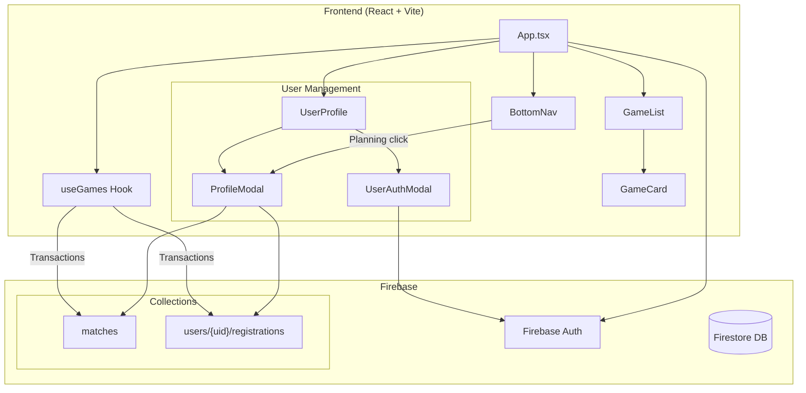

# SCBA Bénévoles 🏀

[](https://scba.desimone.fr)
[](https://github.com/nickdesi/SCBA-Benevolat)
[](https://coolify.io)

Application de gestion du bénévolat pour le **Stade Clermontois Basket Auvergne**.


## 🏗️ Architecture



### Flux de données - Transactions Atomiques

```mermaid
sequenceDiagram
    participant U as User
    participant A as App.tsx
    participant H as useGames Hook
    participant P as ProfileModal
    participant TX as Firestore Transaction
    participant F as Firestore (Matches)
    participant R as Firestore (UserRegs)
    
    U->>A: Ouvre l'application
    A->>H: useGames()
    H->>F: onSnapshot(matches)
    H->>R: onSnapshot(userRegs) [Si connecté]
    F-->>A: Affichage des matchs
    
    %% Inscription avec Transaction
    U->>A: S'inscrit (Buvette)
    A->>H: handleVolunteer()
    H->>TX: runTransaction()
    TX->>F: Lit le match
    TX->>F: Met à jour volunteers[]
    TX->>R: Crée registration doc
    TX-->>H: Commit atomique
    Note over TX,R: Les deux opérations réussissent ou échouent ensemble
    
    %% Accès Planning Mobile
    U->>A: Clique "Planning" (mobile)
    A->>P: Ouvre ProfileModal
    P->>R: Lit registrations (via props)
    P->>F: Vérifie validité (via props games[])
    R-->>P: Liste inscriptions
    
    %% Suppression avec Transaction
    U->>P: Supprime inscription
    P->>H: handleRemoveVolunteer()
    H->>TX: runTransaction()
    TX->>F: Retire nom de volunteers[]
    TX->>R: Supprime registration doc
    TX-->>H: Commit atomique
```



### Navigation Mobile

```mermaid
flowchart LR
    subgraph "BottomNav (Mobile)"
        Home["🏠 Accueil"]
        Planning["📅 Planning"]
        Admin["✓ Admin"]
    end
    
    Home -->|"onViewChange('home')"| HomeView[Vue Matchs]
    Planning -->|"onPlanningClick()"| ProfileModal[Mon Espace Bénévole]
    Admin -->|"isAdmin only"| AdminModal[Admin Auth]
    
    style Planning fill:#fef3c7
    style Admin fill:#d1fae5
```



## ✨ Fonctionnalités

### 👥 Pour les parents & Bénévoles

- **Inscription facile** :
  - **Invité** : Inscription immédiate sans compte (stockage local).
  - **Connecté** : Création de compte (Google ou Email) pour gérer ses inscriptions partout.
- **👤 Mon Espace Bénévoles** :
  - Accessible via le menu profil OU le bouton "Planning" sur mobile.
  - Vue centralisée de toutes vos inscriptions.
  - Gestion et annulation sécurisée de vos missions.
  - Détection automatique des inscriptions obsolètes ou orphelines.
- **Interface moderne** : Design épuré avec dégradés, cartes animées
- **📅 Ajouter au calendrier** : exportez vers Google Agenda, Apple Calendar ou Outlook
- **🚗 Covoiturage** : proposez des places (conducteur) ou cherchez une place (passager)
- **🔄 Mise à jour automatique** : synchronisation temps réel via Firebase
- **💊 Badge Covoiturage** : Notification immédiate des places dispo

### 🔧 Pour les administrateurs

- **🔐 Authentification Firebase** : Connexion sécurisée
- **🏠 Matchs Domicile / 🚗 Extérieur** : différenciation des types de matchs
- **📥 Import en masse** : Copier-coller depuis le calendrier FFBB
- **Gestion des matchs** : ajouter, modifier, supprimer
- **Admin visible uniquement si connecté** : Le bouton Admin n'apparaît que pour les comptes administrateurs

### 🎨 Interface moderne

- Design responsive (mobile & desktop)
- Skeleton Loader pendant le chargement
- Animation de célébration quand un match est complet
- Notifications toast avec auto-dismiss
- Navigation mobile simplifiée (Accueil + Planning)

## 📋 Prérequis

- **Node.js** : v22.12.0 ou supérieur (nécessaire pour Vite 7)

## 🚀 Installation

```bash
# Cloner le dépôt
git clone https://github.com/nickdesi/SCBA-Benevolat.git
cd SCBA-Benevolat

# Installer les dépendances
npm install

# Lancer en développement
npm run dev
```

## ⚙️ Configuration

### Firebase Authentication

Le projet supporte deux niveaux d'accès :

1. **Utilisateurs (Bénévoles)** : Inscription via Google ou Email/Mot de passe pour gérer leur profil.
2. **Administrateur** : Compte unique (`benevole@scba.fr`) avec droits d'édition globaux.

### Variables d'environnement (optionnel)

```env
VITE_FIREBASE_API_KEY=your_api_key
VITE_FIREBASE_AUTH_DOMAIN=your_project.firebaseapp.com
VITE_FIREBASE_PROJECT_ID=your_project_id
```

## 📁 Structure du projet

```
├── App.tsx                 # Composant principal (UI + state + lazy loading)
├── firebase.ts             # Config Firebase (Firestore + Auth)
│
├── components/
│   ├── UserProfile.tsx     # Menu utilisateur et avatar
│   ├── ProfileModal.tsx    # Modal "Mon Espace Bénévole"
│   ├── UserAuthModal.tsx   # Modal Connexion/Inscription
│   ├── GameList.tsx        # Liste groupée des matchs
│   ├── GameCard.tsx        # Carte de match (memoized + lazy GameForm)
│   ├── GameForm.tsx        # Formulaire ajout/édition (lazy-loaded)
│   ├── VolunteerSlot.tsx   # Inscriptions bénévoles (logique hybride Guest/Auth)
│   ├── CarpoolingSection.tsx # Section covoiturage
│   ├── PhoneDisplay.tsx    # Affichage téléphone avec masquage
│   ├── AdminAuthModal.tsx  # Login Admin (lazy-loaded)
│   ├── ImportCSVModal.tsx  # Import CSV (lazy-loaded)
│   ├── Header.tsx          # En-tête avec filtre équipe
│   ├── BottomNav.tsx       # Navigation mobile (Accueil + Planning + Admin si admin)
│   ├── MatchTicker.tsx     # Bandeau défilant
│   └── ...
│
├── utils/
│   ├── useGames.ts         # Hook Firebase (CRUD + Transactions atomiques)
│   ├── authStore.ts        # Auth Firebase (Google, Email)
│   ├── dateUtils.ts        # Parsing dates centralisé
│   ├── calendar.ts         # Export calendrier (ICS, Google, Outlook)
│   ├── storage.ts          # Utilitaires localStorage
│
├── types.ts                # Types TypeScript (incl. UserRegistration)
├── constants.ts            # Constantes (rôles, mois)
└── styles.css              # Design system global
```

## ⚡ Optimisations

### Code-Splitting (React.lazy)

Les modals et formulaires sont chargés à la demande :

- `AdminAuthModal` (~5 KB)
- `ImportCSVModal` (~14 KB)
- `GameForm` (~10 KB)

### Bundle Splitting (Vite 7)

- Séparation automatique des dépendances (`vendor-react`, `vendor-firebase`) via `manualChunks`.
- Réduction significative du bundle principal (Main Entry < 300kB).

### Firestore Transactions

Les opérations critiques utilisent des **transactions atomiques** pour garantir la cohérence des données :

```typescript
await runTransaction(db, async (transaction) => {
    // 1. Lecture du match
    const gameDoc = await transaction.get(gameRef);
    
    // 2. Mise à jour des volunteers dans le match
    transaction.update(gameRef, { roles: updatedRoles });
    
    // 3. Création/suppression de la registration utilisateur
    transaction.set(userRegRef, { ... });
});
```

**Avantage** : Si une des opérations échoue, tout est annulé automatiquement.

### Firestore Query

Seuls les matchs futurs sont récupérés (server-side filter) :

```typescript
query(collection(db, "matches"), where("dateISO", ">=", todayISO))
```

## 🔒 Sécurité & Confidentialité

- **Modèle Hybride d'Identité** :
  - **Invités** : L'identité est stockée dans le `localStorage` du navigateur.
  - **Connectés** : L'identité est vérifiée via Firebase Auth et stockée dans Firestore (`users/{uid}/registrations`).
- **Transactions atomiques** : Garantissent l'intégrité des données entre la feuille de match publique et les registrations privées.
- **Isolation des données** : Un utilisateur connecté ne peut gérer que ses propres inscriptions.
- **Firebase Security** : Authentification et règles de sécurité Firestore.
- **Protection des données** : Validation en temps réel pour empêcher la suppression d'inscriptions d'autres utilisateurs.
- **Admin conditionnel** : Le bouton Admin n'est visible que pour les comptes administrateurs authentifiés.

## 📱 Responsive

L'application est optimisée pour :

- 📱 Mobile (navigation bottom bar simplifiée, Planning ouvre la modale)
- 💻 Desktop (grille 2 colonnes, hover effects, menu déroulant complet)

## 🎉 Célébration automatique

Quand tous les postes d'un match sont pourvus :

- Carte passe en vert avec animation
- Badge "COMPLET" affiché
- Message de remerciement

---

Fait avec ❤️ pour le Stade Clermontois Basket Auvergne
